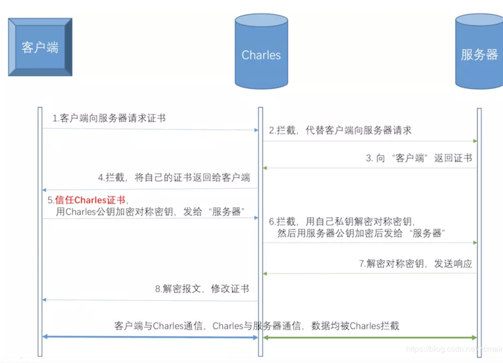

## 签名原理

### 学习路线


### 加解密简介

+ 常见英文

  - encrypt：加密
  - decrypt：解密
  - plaintext：明文
  - ciphertext：密文

+ 学前须知

  + 为了便于学习，设计4个虚拟人物
    - Alice、Bob：互相通信
    - Eve：窃听者
    - Mallory：主动攻击者

+ 如何放置被窃听?

  

  - 发送端将消息进行**加密**后发送密文，这样窃听者就只能得到密文
  - 接收端将密文进行**解密**得到明文

+ 如何加密解密？

  

  - 发送端通过密钥进行加密
  - 接收端通过同一个密钥进行解密

  

### 密码的类型

+ 根据密钥的使用方法，可以将密码分为2种

  - 对称密码

  - 公钥密码（非对称密码）

    

  

### 对称密码

+ 对称密码（Symmetric Cryptography）

+ 在对称密码中，加密、解密时使用的是同一个密钥

  

+ 常见的对称密码算法有

  - DES
  - 3DES
  - AES

+ DES（Data Encryption Standard）

  

  - DES是一种将64bit明文加密成64bit密文的对称密码算法，密钥长度是56bit
  - 规格上来说，密钥长度是64bit，但每隔7bit会设置一个用于错误检查的bit，因此密钥长度实质上是56bit
  - 由于DES每次只能加密64bit的数据，遇到比较大的数据，需要对DES加密进行迭代（反复）
  - 目前已经可以在短时间内被破解，所以不建议使用

+ 3DES

  + 3DES，将DES重复3次所得到的一种密码算法，也叫做3重DES

  + 目前还被一些银行等机构使用，但处理速度不高，安全性逐渐暴露出问题

  + 3个密钥都是不同的，也称为DES-EDE3

    

  + 如果所有密钥都使用同一个，则结果与普通的DES是等价的

    

  + 如果密钥1、密钥3相同，密钥2不同，称为DES-EDE2

    

+ AES（Advanced Encryption Standard）

  - 取代DES成为新标准的一种对称密码算法
  - AES的密钥长度有128、192、256bit三种
  - 在2000年时选择Rijindael算法作为AES的实现
  - 目前AES，已经逐步取代DES、3DES，成为首选的对称密码算法
  - 一般来说，我们也不应该去使用任何自制的密码算法，而是应该使用AES，它经过了全世界密码学家所进行的高品质验证工作

### 密钥配送问题

+ 在使用对称密码时，一定会遇到密钥配送问题

+ 假设，Alice将**使用对称密码加密过的消息**发给了Bob

  - 只有将密钥发送给Bob，Bob才能完成解密

  - 在发送密钥过程中，可能会被Eve窃取密钥，最后Eve也能完成解密

    

  

### 如何解决密钥配送问题

+ 有以下几种解决密钥配送的方法
  - 事先共享密钥
  - 密钥分配中心
  - Diffie-Hellman密钥交换
  - **公钥密码(常用的)**

### 公钥密码

+ 公钥密码（Public-key Cryptography）

+ 公钥密码中，密钥分为`加密密钥`、`解密密钥`2种，它们并不是同一个密钥

+ 公钥密码也被称为`非对称密码（Asymmetric Cryptography）`

+ 在公钥密码中

  - 加密密钥，一般是公开的，因此该密钥称为公钥（public key）

  - 解密密钥，由消息接收者自己保管的，不能公开，因此也称为私钥（private key）

  - 公钥和私钥是一 一对应的，是不能单独生成的，一对公钥和密钥统称为密钥对（key pair）

  - 由公钥加密的密文，必须使用与该公钥对应的私钥才能解密

  - 由私钥加密的密文，必须使用与该私钥对应的公钥才能解密

    

+ 公钥密码加密消息

  - 没有密钥配送问题

  - 由消息的接收者，生成一对公钥、私钥

  - 将公钥发给消息的发送者

  - 消息的发送者使用公钥加密消息

    

+ RSA
  - 目前使用最广泛的公钥密码算法是RSA
  - RSA的名字，由它的3位开发者，即Ron Rivest、Adi Shamir、Leonard Adleman的姓氏首字母组成
+ 可以`用公钥密码加密对称密钥`，解决对称密码的密钥配送问题


### 混合密码系统

+ 混合密码系统（Hybrid Cryptosystem）
+ 对称密码的缺点
  - 不能很好地解决密钥配送问题
+ 公钥密码的缺点
  - 加密解密速度比较慢
+ 混合密码系统，是将对称密码和公钥密码的优势相结合的方法
  - 利用对称密码进行消息的加密, 解决了公钥密码速度慢的问题
  - 并通过公钥密码解决了对称密码的密钥配送问题

+ 网络上的密码通信所用的SSL/TLS都运用了混合密码系统

### 混合密码-加密

+ 会话密钥（session key）

  - 为本次通信随机生成的临时密钥
  - 作为对称密码的密钥，用于加密消息，提高速度

+ 加密步骤（发送消息）

  1. 首先，消息发送者要拥有消息接收者的公钥
  2. 生成会话密钥，作为对称密码的密钥，加密消息
  3. 用消息接收者的公钥，加密会话密钥
  4. 将前2步生成的加密结果，一并发给消息接收者

+ 发送出去的内容包括

  - 用会话密钥加密的消息（加密方法：对称密码）
  - 用公钥加密的会话密钥（加密方法：公钥密码）

  

### 混合密码-解密

+ 解密步骤（收到消息）
  1. 消息接收者用自己的私钥解密出会话密钥
  2. 再用第1步解密出来的会话密钥，解密消息


### 混合密码-加密解密流程

> Alice >>>>> Bob

+ 发送过程，加密过程
  1. Bob先生成一对公钥、私钥
  2. .Bob把公钥共享给Alice
  3. Alice随机生成一个会话密钥（临时密钥）
  4. Alice用会话密钥加密需要发送的消息（使用的是对称密码加密）
  5. Alice用Bob的公钥加密会话密钥（使用的是公钥密码加密，也就是非对称密码加密）
  6. Alice把第4、5步的加密结果，一并发送给Bob
+ 接收过程，解密过程
  1. Bob利用自己的私钥解密会话密钥（使用的是公钥密码解密，也就是非对称密码解密）
  2. Bob利用会话密钥解密发送过来的消息（使用的是对称密码解密）

### 单向散列函数

+ 单向散列函数（One-way hash function）
+ 单向散列函数，可以根据根据消息内容计算出散列值
+ 单向散列函数，又被称为消息摘要函数（message digest function），哈希函数
+ 输出的散列值，也被称为消息摘要（message digest）、指纹（fingerprint）

+ 散列值的长度和消息的长度无关，无论消息是1bit、10M、100G，单向散列函数都会计算出固定长度的散列值

  

### 单向散列函数的特点

+ 根据任意长度的消息，计算出固定长度的散列值

+ 计算速度快，能快速计算出散列值

+ 消息不同，散列值也不同。而且即使消息只有细微的差异，散列值相差也很大。

  

+ 具备单向性

  

  

### 常见的单向散列函数种类

+ MD4、MD5
  - 产生128bit的散列值，MD就是Message Digest的缩写，目前已经不安全
  - Mac终端上默认可以使用md5命令
+ SHA-1
  - 产生160bit的散列值，目前已经不安全
+ SHA-2
  - SHA-256、SHA-384、SHA-512，散列值长度分别是256bit、384bit、512bit
+ SHA-3
  - 全新标准

### 单向散列函数的应用 – 防止数据被篡改


### 单向散列函数的应用 – 用户密码加密


### 如何防止数据被篡改?

+ Alice发的内容有可能是被篡改的，或者有人伪装成Alice发消息？
+ 问题来了：Bob如何确定这段消息的真实性？
+ 解决方案: **数字签名**

### 数字签名

+ 在数字签名技术中，有以下2种行为
  - 生成签名
    - 由消息的发送者完成，通过“签名密钥”生成
    - 用公钥密码中的私钥来生成签名
  - 验证签名
    - 由消息的接收者完成，通过“验证密钥”验证
    - 用公钥密码中的公钥来验证签名
+ 如何能保证这个签名是消息发送者自己签的？
  - 用消息发送者的私钥进行签名
+ 数字签名只能用来解决消息被篡改的问题，没有加密功能。

### 数字签名和公钥密码对比

+ 数字签名和公钥密码

  

### 数字签名的过程


- 签名的消息体与原消息体一样大，造成发送的消息内容过多。

### 数字签名的过程-改进


+ 对散列进行数字签名，然后对比散列值

### 数字签名 – 疑惑

+ 如果有人篡改了文件内容或者签名内容，会是什么结果？
  - 结果是：签名验证失败，证明内容会篡改
+ 数字签名不能保证机密性？
  - 数字签名的作用不是为了保证机密性，仅仅是为了能够识别内容有没有被篡改
+ 数字签名的作用
  - 确认消息的完整性
  - 识别消息是否被篡改
  - 防止消息发送人否认

### 数字签名无法解决的问题

+ 要正确使用签名，前提是

  - 用于验证签名的公钥必须属于真正的发送者

+ 如果遭遇了中间人攻击，那么

  - 混合密码系统中间人攻击

    

  - 数字签名时中间人攻击

    1. alice将公钥发给bob时，被中间人Mallory拦截，将中间人Mallory的公钥发给bob
    2. alice用私钥将对消息散列进行签名，将签名和消息一起发送时
    3. 中间人Mallory拦截到签名和消息，其伪造消息，并用自己的私钥生成签名，然后继续发送给bob
    4. bob用收到的公钥进行验证签名，得到的散列值与计算出的散列值相同。签名失效

  - 公钥将是伪造的
  - 数字签名将失效

+ 所以在验证签名之前，首先得先验证公钥的合法性

+ 如何验证公钥的合法性？

  - 证书

### 证书

+ 证书，联想的是驾驶证、毕业证、英语四六级证等等，都是由权威机构认证的
+ 密码学中的证书，全称叫公钥证书（Public-key Certificate，PKC），跟驾驶证类似
  - 里面有姓名、邮箱等个人信息，以及此人的公钥
  - 并由认证机构（Certificate Authority，CA）施加数字签名
+ CA就是能够认定“公钥确实属于此人”并能够生成数字签名的个人或者组织
  - 有国际性组织、政府设立的组织
  - 有通过提供认证服务来盈利的企业
  - 个人也可以成立认证机构
  - CA证书中心利用数字签名解决公钥合法性的问题

### 证书的利用


### 证书的注册和下载


### 小结

1. 对称密码
   - 加密解密用的是同一个密钥
   - 加密解密速度快
   - 无法解决密钥配送问题
2. 公钥密码
   - 加密解密用的是不同的密钥
   - 加密解密过程慢
   - 解决密钥配送问题
3. 单项散列函数
   - 根据消息生成对应的固定长度的散列值
   - 防止数据被篡改
4. 数字签名
   - 用私钥加密消息的散列值，生成的密文
5. 证书
   - 用CA的私钥， 对公钥生成数字签名

+ 个人理解
  - 对称密钥：解决消息的加密解密问题，但是存在密钥配送问题。
  
  - 公钥密码:  解决对称密钥配送问题，但是存在中间人攻击，拿到的接收端的公钥被伪造。
  
  - 单项散列函数: 用来对内容生成摘要，指纹。
  
  - 数字签名: 用来保证数据没有被篡改
  
  - 证书: 利用单项散列函数，数字签名来解决公钥合法性的问题
    - 利用CA证书中心的私钥对接收端的公钥的散列值进行数字签名生成证书，用CA证书中心的公钥验证前面取出接收端的公钥，然后用该公钥进行对称密钥的配送
    - 这就来保证发送端拿到的公钥是合法的
    
  - https可以防止中间人攻击？
  
    - 利用证书解决公钥合法性
  
      ```
      1. 客户端向服务器请求时，服务器将证书信息发送过来
      2. 客户端利用CA证书中心的公钥验证证书的合法性，即验证证书签名是否合法
      ```
  
      https://blog.csdn.net/love_hot_girl/article/details/81164279
  
      https://www.jianshu.com/p/c5c178ddcf1c
  
    - 在进行https通信时，需要进行challenge

### charles抓取https的原理?

https://blog.csdn.net/zcmain/article/details/98737243

Charles作为一个“中间人代理”，当浏览器和服务器通信时，Charles接收服务器的证书，但动态生成一张证书发送给浏览器，也就是说Charles作为中间代理在浏览器和服务器之间通信，所以通信的数据可以被Charles拦截并解密。由于Charles更改了证书，浏览器校验不通过会给出安全警告，必须安装Charles的证书后才能进行正常访问。



1. 客户端向服务器发起HTTPS请求
2. Charles拦截客户端的请求，伪装成客户端向服务器进行请求
3. 服务器向“客户端”（实际上是Charles）返回服务器的CA证书
4. Charles拦截服务器的响应，获取服务器证书公钥，然后自己制作一张证书，将服务器证书替换后发送给客户端。（这一步，Charles拿到了服务器证书的公钥）
5. 客户端接收到“服务器”（实际上是Charles）的证书后，生成一个对称密钥，用Charles的公钥加密，发送给“服务器”（Charles）
6. Charles拦截客户端的响应，用自己的私钥解密对称密钥，然后用服务器证书公钥加密，发送给服务器。（这一步，Charles拿到了对称密钥）
7. 服务器用自己的私钥解密对称密钥，向“客户端”（Charles）发送响应
8. Charles拦截服务器的响应，替换成自己的证书后发送给客户端
9. 至此，连接建立，Charles拿到了 服务器证书的公钥 和 客户端与服务器协商的对称密钥，之后就可以解密或者修改加密的报文了。

### iOS签名机制

+ iOS签名机制的作用
  - 保证安装到用户手机上的APP都是经过Apple官方允许的

+ 不管是真机调试，还是发布APP，开发者都需要经过一系列复杂的步骤
  - 生成`CertificateSigningRequest.certSigningRequest`文件
  - 获得`ios_development.cer\ios_distribution.cer`证书文件
  - 注册device、添加App ID
  - 获得`*.mobileprovision`文件
+ 对于真机调试，现在的Xcode已经自动帮开发者做了以上操作


### 真机调试时的签名


### 真机调试签名流程图


1. 用mac私钥对app进行数字签名

   - 私钥可以简单理解为p12文件

   - 用私钥对app的散列值进行加密生成数字签名

   - 对app所有资源生成的签名信息

     

   - 对可执行文件生成的签名信息

     

2. Apple的私钥对Mac的公钥进行签名，将mac公钥和签名信息一起生成证书

   - Apple的私钥位于Apple服务器上

   - Mac上公钥和私钥是同时生成的

   - Mac的公钥其实就是我们创建证书时申请的`CertificateSigningRequest.certSigningRequest`文件

     

     

   - 我们将申请的csr文件上传到苹果后台生成一个证书

     - 该证书包含Mac公钥信息

     - 苹果私钥对公钥散列的签名信息

     - 这一步实际上保证了Mac公钥的合法性，后面从该证书中得到的公钥就是合法的

       

       

3. 在苹果后台，将证书信息， devices， app id， entitlements等信息合在一起，进行散列后，用苹果的私钥进行数字签名。然后生成mobileprovision文件。

   - 该mobileprovision会被放到安装包中

   - mobileprovision包含的信息有

     - 证书信息
     - devices
     - app id
     - entitlements
     - 对上述内容的数字签名信息

     

     

4. 用Apple的公钥验证mobileprovison中的签名信息
   + 在每台iOS设备中都存在Apple的公钥
   + 验证签名步骤
     1. 用Apple的公钥进行解密得到散列值
     2. 然后将证书，devices等信息进行散列后得到散列值
     3. 比较两个散列值是否相等
   + 如果验证通过，说明证书，devices， apple id和entitlements等都没有问题
5. 用Apple的公钥验证证书中的签名信息
   - 验证签名步骤
     1. 用Apple的公钥进行解密得到散列值
     2. 然后将Mac公钥进行散列后得到散列值
     3. 比较两个散列值是否相等
   - 如果验证通过，说明Mac公钥是合法的
6. 拿到Mac公钥对安装包中的两个签名进行验证
   + 防止资源被篡改
   + 防止可执行文件被篡改

### iOS签名机制 – 安全检测


### iOS签名机制 - AppStore

+ 如果APP是从AppStore下载安装的，你会发现里面是没有mobileprovision文件的

+ 它的验证流程会简单很多，大概如下所示

  

  - 从苹果后台下载的包相当于是Apple私钥进行签名的
  - 因为已经保证了各种权限，设备，app id等是合法的，所以只需要验证包内的资源和代码是否被串改过即可

### 小结

+ csr文件
  - Mac公钥
+ .cer文件
  - 利用Apple私钥（CA）,对Mac公钥生成了数字签名
+ .mobileprovision
  - 利用Apple私钥（CA）,对【.cer证书+devices+app id, entitlements】生成了数字签名

